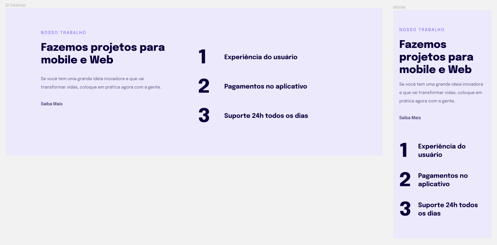

# 💻 Projeto: Nosso Trabalho 

 

## 📌 Sobre o Projeto

Projeto desenvolvido no programa Explorer da Rocketseat.
Assuntos importantes abordados: 

  * Responsividade
  * Mobile First 

Figma: https://www.figma.com/file/Xgv0dMFmtmlfA3taGXUraH/Explorer-Stage-03-Projeto-02-(Copy)?node-id=203%3A412

 

## 📌 Tecnologias 

Esse projeto foi desenvolvido com as seguintes tecnologias:

* HTML
* CSS

 

## 📝 Licença

Esse projeto está sob a licença MIT. Veja o arquivo [LICENSE](LICENSE) para mais detalhes.

 
 

<h4 align="center">
    Por Rodrigo de Morais 🚀
</h4>
